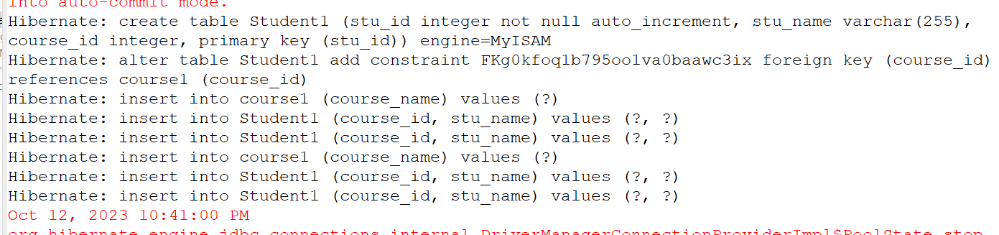
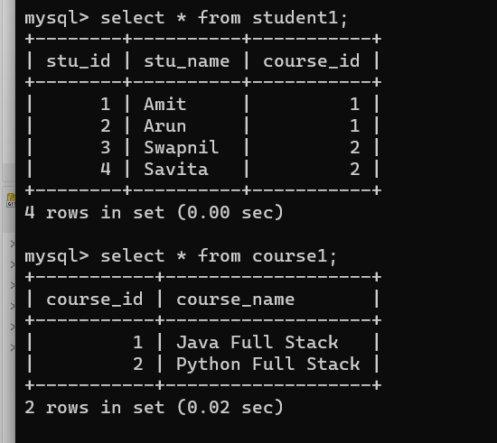

# OneToManyStudentCourse

This repository showcases a Java application with Hibernate, illustrating a one-to-many relationship between Student and Course entities. It demonstrates how one courses can assign to multiple students, offering a fundamental example of database relationships using Hibernate.

